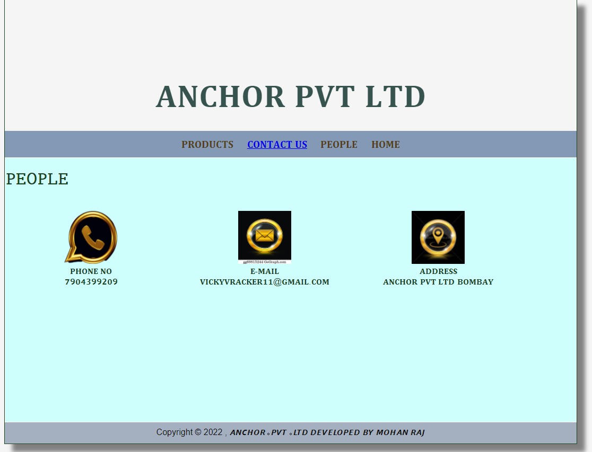

# Web Design for a Software Product Company

## AIM:

To design a static website for a software product company company.

## DESIGN STEPS:

### Step 1:

Requirement collection.

### Step 2:

Creating the layout using HTML and CSS.

### Step 3:

Updating the sample content.

### Step 4:

Choose the appropriate style and color scheme.

### Step 5:

Validate the layout in various browsers.

### Step 6:

Validate the HTML code.

### Step 6:

Publish the website in the given URL.

## PROGRAM :

HOME:

<!DOCTYPE html>
<html lang="en">
  <head>
    <title>𝐀𝐍𝐂𝐇𝐎𝐑 𝐏𝐕𝐓 𝐋𝐓𝐃E</title>
    <link rel="stylesheet" href="./css/layout.css" />
    <link rel="icon" href="./img/icon.png" type="image/x-icon" />
  </head>

  <body>
    

      
𝐀𝐍𝐂𝐇𝐎𝐑 𝐏𝐕𝐓 𝐋𝐓𝐃

      

        
<a href="/static/product.html">𝐇𝐎𝐌𝐄</a>

        
<a href="/static/home.html">𝐏𝐑𝐎𝐃𝐔𝐂𝐓𝐒</a>

        
<a>𝐏𝐄𝐎𝐏𝐋𝐄</a>

        
<a>𝐂𝐎𝐍𝐓𝐀𝐂𝐓 𝐔𝐒</a>

      

      

        

          <h1>𝘼𝘽𝙊𝙐𝙏 𝙐𝙎</h1>
          
          

            ᴠғx ɪs ᴀ ᴠᴀsᴛ ᴀɴᴅ ᴅʏɴᴀᴍɪᴄ ғɪᴇʟᴅ ᴡɪᴛʜ ᴍᴜʟᴛɪᴘʟᴇ ᴏᴘᴘᴏʀᴛᴜɴɪᴛɪᴇs ɪɴ ᴛʜᴇ ᴍᴇᴅɪᴀ ᴀɴᴅ ᴇɴᴛᴇʀᴛᴀɪɴᴍᴇɴᴛ ɪɴᴅᴜsᴛʀʏ. ᴛʜᴇ sᴄᴏᴘᴇ ᴀɴᴅ ᴡᴏʀᴋ ᴏғ ᴠғx ɪs ɴᴏᴛ ʀᴇsᴛʀɪᴄᴛᴇᴅ ᴛᴏ ᴀ sɪɴɢʟᴇ ᴠғx sᴏғᴛᴡᴀʀᴇ ᴏʀ ᴀɴʏ ᴏɴᴇ ᴘᴀʀᴛɪᴄᴜʟᴀʀ ᴀɴɪᴍᴀᴛɪᴏɴ ᴛᴏᴏʟ. ᴠᴀʀɪᴏᴜs ᴛʏᴘᴇs ᴏғ ᴅɪɢɪᴛᴀʟ ᴛᴏᴏʟs ᴀɴᴅ sᴏғᴛᴡᴀʀᴇ ᴀʀᴇ ᴜsᴇᴅ ʙʏ ᴠғx ᴀʀᴛɪsᴛs ᴛᴏ ᴄʀᴇᴀᴛᴇ ᴀ ɢᴏᴏᴅ ᴠɪsᴜᴀʟɪsᴇᴅ sʜᴏᴛ. ᴛᴏ ᴍᴀsᴛᴇʀ ᴀʟʟ ᴛʜᴇsᴇ ᴠɪsᴜᴀʟ ᴇғғᴇᴄᴛs ᴀʟʟ ʏᴏᴜ ʜᴀᴠᴇ ᴛᴏ ᴅᴏ ɪs ʟᴇᴀʀɴ ᴅɪғғᴇʀᴇɴᴛ ᴛʏᴘᴇs ᴏғ ᴠғx sᴏғᴛᴡᴀʀᴇ ᴀɴᴅ ᴜsᴇ ᴛʜᴏsᴇ ʟɪᴋᴇ ᴀ ᴘʀᴏғᴇssɪᴏɴᴀʟ ᴛᴏ ᴘʀᴏᴅᴜᴄᴇ ᴛʜᴇ ʙᴇsᴛ ᴇғғᴇᴄᴛs.
             
            ᴠғx ɪɴᴠᴏʟᴠᴇs ᴛʜᴇ ɪɴᴛᴇɢʀᴀᴛɪᴏɴ ᴏғ ʟɪᴠᴇ-ᴀᴄᴛɪᴏɴ ғᴏᴏᴛᴀɢᴇ (ᴡʜɪᴄʜ ᴍᴀʏ ɪɴᴄʟᴜᴅᴇ ɪɴ-ᴄᴀᴍᴇʀᴀ sᴘᴇᴄɪᴀʟ ᴇғғᴇᴄᴛs) ᴀɴᴅ ɢᴇɴᴇʀᴀᴛᴇᴅ-ɪᴍᴀɢᴇʀʏ (ᴅɪɢɪᴛᴀʟ ᴏʀ ᴏᴘᴛɪᴄs, ᴀɴɪᴍᴀʟs ᴏʀ ᴄʀᴇᴀᴛᴜʀᴇs) ᴡʜɪᴄʜ ʟᴏᴏᴋ ʀᴇᴀʟɪsᴛɪᴄ, ʙᴜᴛ ᴡᴏᴜʟᴅ ʙᴇ ᴅᴀɴɢᴇʀᴏᴜs, ᴇxᴘᴇɴsɪᴠᴇ, ɪᴍᴘʀᴀᴄᴛɪᴄᴀʟ, ᴛɪᴍᴇ-ᴄᴏɴsᴜᴍɪɴɢ ᴏʀ ɪᴍᴘᴏssɪʙʟᴇ ᴛᴏ ᴄᴀᴘᴛᴜʀᴇ ᴏɴ ғɪʟᴍ. ᴠɪsᴜᴀʟ ᴇғғᴇᴄᴛs ᴜsɪɴɢ ᴄᴏᴍᴘᴜᴛᴇʀ-ɢᴇɴᴇʀᴀᴛᴇᴅ ɪᴍᴀɢᴇʀʏ (ᴄɢɪ) ʜᴀᴠᴇ ᴍᴏʀᴇ ʀᴇᴄᴇɴᴛʟʏ ʙᴇᴄᴏᴍᴇ ᴀᴄᴄᴇssɪʙʟᴇ ᴛᴏ ᴛʜᴇ ɪɴᴅᴇᴘᴇɴᴅᴇɴᴛ ғɪʟᴍᴍᴀᴋᴇʀ ᴡɪᴛʜ ᴛʜᴇ ɪɴᴛʀᴏᴅᴜᴄᴛɪᴏɴ ᴏғ ᴀғғᴏʀᴅᴀʙʟᴇ ᴀɴᴅ ʀᴇʟᴀᴛɪᴠᴇʟʏ ᴇᴀsʏ-ᴛᴏ-ᴜsᴇ ᴀɴɪᴍᴀᴛɪᴏɴ ᴀɴᴅ ᴄᴏᴍᴘᴏsɪᴛɪɴɢ sᴏғᴛᴡᴀʀᴇ.
            <ul>
              <li>𝐒𝐢𝐦𝐩𝐥𝐞 𝐭𝐨 𝐥𝐞𝐚𝐫𝐧, 𝐞𝐚𝐬𝐢𝐞𝐫 𝐭𝐨 𝐮𝐬𝐞</li>
              <li>I𝐧𝐬𝐢𝐠𝐡𝐭𝐟𝐮𝐥 , 𝐚𝐜𝐭𝐢𝐨𝐧𝐚𝐛𝐥𝐞 & 𝐜𝐮𝐬𝐭𝐨𝐦𝐢𝐳𝐚𝐛𝐥𝐞 𝐫𝐞𝐩𝐨𝐫𝐭𝐬</li>
              <li>𝐀𝐧𝐲𝐰𝐡𝐞𝐫𝐞, 𝐚𝐧𝐲𝐭𝐢𝐦𝐞 𝐚𝐧𝐝 𝐬𝐞𝐜𝐮𝐫𝐞 𝐚𝐜𝐜𝐞𝐬𝐬</li>
            </ul>
          

        

      

      

        Copyright &#169; 2022  𝘼𝙉𝘾𝙃𝙊𝙍 ｡𝙋𝙑𝙏 ｡𝙇𝙏𝘿 𝘿𝙀𝙑𝙀𝙇𝙊𝙋𝙀𝘿 𝘽𝙔 𝙈𝙊𝙃𝘼𝙉 𝙍𝘼𝙅
      

    

  </body>
</html>

PRODUCTS:

<!DOCTYPE html>
<html lang="en">
  <head>
    <title>𝐀𝐍𝐂𝐇𝐎𝐑 𝐏𝐕𝐓 𝐋𝐓𝐃</title>
    <link rel="stylesheet" href="./css/layout.css" />
    <link rel="icon" href="./img/icon.png" type="image/x-icon" />
  </head>

  <body>
    

      
𝐀𝐍𝐂𝐇𝐎𝐑 𝐏𝐕𝐓 𝐋𝐓𝐃

      

        
<a href="/static/home.html">𝐇𝐎𝐌𝐄</a>

        

          <a href="/static/products.html">𝐏𝐑𝐎𝐃𝐔𝐂𝐓𝐒</a>
        

        
<a>𝐏𝐄𝐎𝐏𝐋𝐄</a>

        
<a>𝐂𝐎𝐍𝐓𝐀𝐂𝐓 𝐔𝐒</a>

      

      

        
    
          <h1>🇴‌🇺‌🇷‌ 🇵‌🇷‌🇪‌🇲‌🇮‌🇺‌🇲‌ 🇵‌🇷‌🇴‌🇩‌🇺‌🇨‌🇹‌🇸‌</h1>
          

              
 
                  

                  
                  

                  
ʙʟᴇɴᴅᴇʀ ᴠғx

                  
🅟🅡🅘🅒🅔: Rs.𝟭𝟬❟𝟬𝟬𝟬 

              

              
 
                

                
                

                
ɴᴜᴋᴇ

                
🅟🅡🅘🅒🅔: Rs.𝟗,𝟎𝟎𝟎 

            

            
 
              

              
              

              
ʜɪᴛғɪʟᴍ

              
🅟🅡🅘🅒🅔: Rs.𝟴❟𝟬𝟬𝟬 

          

          
 
            

            
            

            
𝟺ᴅ ᴄɪɴᴇᴍᴀ

            
🅟🅡🅘🅒🅔: Rs.𝟭𝟬❟𝟬𝟬𝟬 

        

        
 
          

          
          

          
ғᴜsɪᴏɴ 𝟹𝟼𝟶

          
🅟🅡🅘🅒🅔: Rs.𝟗,𝟎𝟎𝟎 

      

      
 
        

        
        

        
ᴀᴜᴛᴏᴅᴇsᴋ ᴍᴀʏᴀ

        
🅟🅡🅘🅒🅔: Rs.𝟳❟𝟬𝟬𝟬 

    

    
 
      

      
      

      
𝐙𝐁𝐫𝐮𝐬𝐡

      
🅟🅡🅘🅒🅔: Rs.𝟲❟𝟬𝟬𝟬 

    

    
 
      

      
      

      
ᴍᴏᴄʜᴀ

      
🅟🅡🅘🅒🅔: Rs.𝟲❟𝟬𝟬𝟬 

    

    
 
      

      
      

      
ᴀᴅᴏʙᴇ ᴀғᴛᴇʀ ᴇғғᴇᴄᴛs

      
🅟🅡🅘🅒🅔: Rs.𝟱❟𝟬𝟬𝟬 

    

    
 
      

      
      

      
sʏɴᴛʜᴇʏᴇs

      
🅟🅡🅘🅒🅔: Rs.𝟳❟𝟬𝟬𝟬 

  

  
 
    

    
    

    
ᴠʀᴀʏ

    
🅟🅡🅘🅒🅔: Rs.𝟓❟𝟬𝟬𝟬 

 
  

  
  

  
ʀᴀᴅsʜɪғᴛ 

  
🅟🅡🅘🅒🅔: Rs.𝟲❟𝟬𝟬𝟬 

     

          
        
      

      

        Copyright &#169; 2022 , 𝘼𝙉𝘾𝙃𝙊𝙍 ｡𝙋𝙑𝙏 ｡𝙇𝙏𝘿 𝘿𝙀𝙑𝙀𝙇𝙊𝙋𝙀𝘿 𝘽𝙔 𝙈𝙊𝙃𝘼𝙉 𝙍𝘼𝙅
      

    

  </body>
</html>

PEOPLE:

<!DOCTYPE html>
<html lang="en">
  <head>
    <title>𝐀𝐍𝐂𝐇𝐎𝐑 𝐏𝐕𝐓 𝐋𝐓𝐃</title>
    <link rel="stylesheet" href="./css/layout.css" />
    <link rel="icon" href="./img/icon.png" type="image/x-icon" />
  </head>
  
  <body>
    

      
𝐀𝐍𝐂𝐇𝐎𝐑 𝐏𝐕𝐓 𝐋𝐓𝐃

      

        
<a href="/static/peolpe.html">𝐏𝐑𝐎𝐃𝐔𝐂𝐓𝐒</a>

        

          <a href="/static/products.html">𝐏𝐄𝐎𝐏𝐋𝐄</a>
        

        
<a>𝐇𝐎𝐌𝐄</a>

        
<a>𝐂𝐎𝐍𝐓𝐀𝐂𝐓 𝐔𝐒</a>

      

      

        
    
          <h1>𝙿𝙴𝙾𝙿𝙻𝙴</h1>‌</h1>
          

              
 
                  

                  
                  

                  
sɪᴍʀᴀɴ ᴋᴜᴍᴀʀ

                  
𝐏𝐎𝐒𝐓: 𝐋𝐄𝐀𝐃𝐄𝐑 

              

              
 
                

                
                

                
ᴠᴇᴅᴀ ɪʏᴇʀ

                
𝐏𝐎𝐒𝐓: 𝐂𝐄𝐎 

            

            
 
              

              
              

              
ʙʀᴜᴄᴇ ʀᴀʟsᴛᴏɴ

              
𝐏𝐎𝐒𝐓: 𝐇𝐑 

          

          
 
            

            
            

            
ʟᴇɴ ᴍɪʟʟᴇʀ

            
𝐏𝐎𝐒𝐓: 𝐓𝐄𝐀𝐌 𝐋𝐄𝐀𝐃𝐄𝐑 

        

        
 
          

          
          

          
ᴍᴀɴɪsʜ ᴅᴜɢᴀ

          
𝐏𝐎𝐒𝐓: 𝐄𝐌𝐏𝐋𝐎𝐘𝐄𝐄 

      

      
 
        

        
        

        
sᴀᴄʜɪɴ ʙʜᴀʀᴀᴛʜ

        
𝐏𝐎𝐒𝐓: 𝐄𝐌𝐏𝐋𝐎𝐘𝐄𝐄 

    

     

          
        
      

      

        Copyright &#169; 2022 , 𝘼𝙉𝘾𝙃𝙊𝙍 ｡𝙋𝙑𝙏 ｡𝙇𝙏𝘿 𝘿𝙀𝙑𝙀𝙇𝙊𝙋𝙀𝘿 𝘽𝙔 𝙈𝙊𝙃𝘼𝙉 𝙍𝘼𝙅
      

    

  </body>
</html>

CONTACT US:

<!DOCTYPE html>
<html lang="en">
  <head>
    <title>𝐀𝐍𝐂𝐇𝐎𝐑 𝐏𝐕𝐓 𝐋𝐓𝐃</title>
    <link rel="stylesheet" href="./css/layout.css" />
    <link rel="icon" href="./img/icon.png" type="image/x-icon" />
  </head>
  
  <body>
    

      
𝐀𝐍𝐂𝐇𝐎𝐑 𝐏𝐕𝐓 𝐋𝐓𝐃

      

        
<a href="/static/contact us.html">𝐏𝐑𝐎𝐃𝐔𝐂𝐓𝐒</a>

        

          <a href="/static/products.html">𝐂𝐎𝐍𝐓𝐀𝐂𝐓 𝐔𝐒</a>
        

        
<a>𝐏𝐄𝐎𝐏𝐋𝐄</a>

        
<a>𝐇𝐎𝐌𝐄</a>

      

      

        
    
          <h1>𝙿𝙴𝙾𝙿𝙻𝙴</h1>‌</h1>
          

              
 
                  

                  
                  

                  
𝐏𝐇𝐎𝐍𝐄 𝐍𝐎

                  
𝟳𝟵𝟬𝟰𝟯𝟵𝟵𝟮𝟬𝟵

              

              
 
                

                
                

                
𝐄-𝐌𝐀𝐈𝐋

                
𝐕𝐈𝐂𝐊𝐘𝐕𝐑𝐀𝐂𝐊𝐄𝐑𝟏𝟏@𝐆𝐌𝐀𝐈𝐋.𝐂𝐎𝐌

            

            
 
              

              
              

              
𝐀𝐃𝐃𝐑𝐄𝐒𝐒

              
𝐀𝐍𝐂𝐇𝐎𝐑 𝐏𝐕𝐓 𝐋𝐓𝐃
                𝐁𝐎𝐌𝐁𝐀𝐘

          

     

          
        
      

      

        Copyright &#169; 2022 , 𝘼𝙉𝘾𝙃𝙊𝙍 ｡𝙋𝙑𝙏 ｡𝙇𝙏𝘿 𝘿𝙀𝙑𝙀𝙇𝙊𝙋𝙀𝘿 𝘽𝙔 𝙈𝙊𝙃𝘼𝙉 𝙍𝘼𝙅
      

    

  </body>
</html>

## OUTPUT:

### Home Page:

### PRODUCT:

### PEOPLE:

### CONTACT US:

## Result:

Thus a website is designed for the software product company and the HTML,CSS code are validated.
